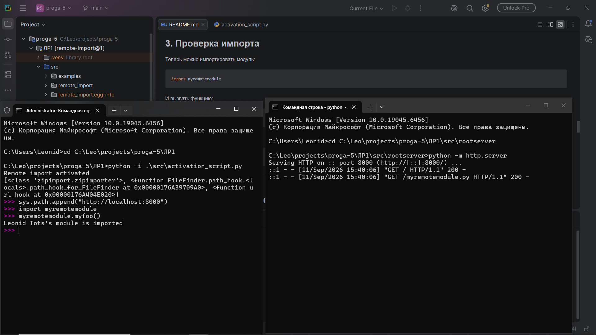
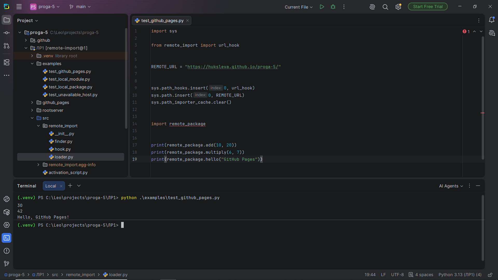

# Лабораторная работа 1 — Реализация удалённого импорта

## Цель работы

Реализовать механизм удалённого импорта Python-модулей по HTTP/HTTPS с использованием `sys.path_hooks`, `PathEntryFinder` и собственного загрузчика.

В работе реализованы:

- удалённый импорт обычных `.py`-модулей;
- загрузка исходного кода через `requests`;
- обработка недоступного удалённого узла;
- удалённый импорт Python-пакета;
- импорт вложенных модулей пакета;
- подготовка внешнего HTTP(S)-размещения через GitHub Pages.

## Структура проекта

```text
ЛР1/
├── src/
│   ├── activation_script.py
│   └── remote_import/
│       ├── __init__.py
│       ├── finder.py
│       ├── hook.py
│       └── loader.py
├── rootserver/
│   ├── index.html
│   ├── myremotemodule.py
│   └── remote_package/
│       ├── index.html
│       ├── __init__.py
│       ├── calculator.py
│       └── greetings.py
├── github_pages/
│   ├── index.html
│   ├── myremotemodule.py
│   └── remote_package/
│       ├── index.html
│       ├── __init__.py
│       ├── calculator.py
│       └── greetings.py
├── examples/
│   ├── test_local_module.py
│   ├── test_local_package.py
│   ├── test_github_pages.py
│   └── test_unavailable_host.py
├── pyproject.toml
└── README.md
```

## Установка

Создать виртуальное окружение и установить зависимости:

```powershell
python -m venv .venv
.\.venv\Scripts\Activate.ps1
pip install -e .
```

## Локальный тест обычного модуля

Перейти в каталог проекта и запустить HTTP-сервер:

```powershell
python -m http.server 8000 --directory rootserver
```

В другом терминале:

```powershell
python -i .\src\activation_script.py
```

После запуска интерпретатора:

```python
sys.path.append("http://localhost:8000")
sys.path_importer_cache.clear()

import myremotemodule
myremotemodule.myfoo()
```

Ожидаемый результат:

```text
Leоnid Tots's module is imported
```



## Тест удалённого пакета

При работающем сервере:

```powershell
python .\examples\test_local_package.py
```

Ожидаемый результат:

```text
5
20
Hello, student!
```

Пакет имеет следующую структуру:

```text
remote_package/
├── __init__.py
├── calculator.py
└── greetings.py
```

При импорте `remote_package` загружается удалённый `__init__.py`. Затем относительные импорты `.calculator` и `.greetings` также обрабатываются механизмом удалённого импорта.



## Как реализована поддержка пакетов

Для обычного модуля используется:

```text
URL/module.py
```

Для пакета используется:

```text
URL/package/__init__.py
```

Для пакета в `ModuleSpec` устанавливается:

```python
is_package=True
```

и:

```python
spec.submodule_search_locations = [package_url]
```

Благодаря этому Python понимает, что импортированный объект является пакетом и может искать внутри него дочерние модули.

Цепочка работы:

```text
sys.path
    ↓
URL
    ↓
url_hook
    ↓
URLFinder
    ↓
URLLoader
    ↓
requests.get()
    ↓
compile()
    ↓
exec()
```

Для вложенного импорта пакета цепочка повторяется для URL самого пакета.

## Обработка недоступного узла

Если HTTP-запрос завершился ошибкой, `url_hook` перехватывает `requests.RequestException` и преобразует её в `ImportError`.

Проверка:

```powershell
python .\examples\test_unavailable_host.py
```

## Пункт 8 — внешний HTTP(S)-хост

В каталоге `github_pages/` подготовлена полностью статическая версия удалённого сервера.

Её можно разместить в GitHub Pages.

1. Создать или использовать публичный GitHub-репозиторий.
2. Скопировать содержимое каталога `github_pages/` в корень публикуемой директории Pages.
3. В настройках репозитория включить GitHub Pages для нужной ветки и каталога.
4. Получить адрес вида:

```text
https://USERNAME.github.io/REPOSITORY/
```

5. Открыть `examples/test_github_pages.py`.
6. Заменить:

```python
REMOTE_URL = "https://YOUR_USERNAME.github.io/YOUR_REPOSITORY/"
```

на фактический адрес.
7. Запустить:

```powershell
python .\examples\test_github_pages.py
```

Важно: в `github_pages/` присутствуют `index.html`, потому что механизм `url_hook` получает список доступных файлов через HTML-страницу каталога. Для обычного `SimpleHTTPRequestHandler` индекс генерируется автоматически, а для GitHub Pages статические `index.html` подготовлены вручную.

## Основные компоненты

### `url_hook`

Проверяет, что элемент `sys.path` является HTTP/HTTPS-адресом, получает HTML каталога и определяет доступные модули и пакеты.

### `URLFinder`

Реализует `PathEntryFinder`.

Для обычного модуля создаёт спецификацию с адресом:

```text
URL/module.py
```

Для пакета:

```text
URL/package/__init__.py
```

и задаёт `submodule_search_locations`.

### `URLLoader`

Получает исходный код через:

```python
requests.get(...)
```

После этого исходный текст компилируется:

```python
compile(source, url, mode="exec")
```

и выполняется в пространстве имён импортируемого модуля:

```python
exec(code, module.__dict__)
```

## Проверка ошибки до подключения URL

До добавления удалённого адреса в `sys.path` модуль не должен находиться стандартным механизмом импорта:

```python
import myremotemodule
```

После:

```python
sys.path.append("http://localhost:8000")
sys.path_importer_cache.clear()
```

механизм `url_hook` получает управление и находит удалённый модуль.

## Результат

В лабораторной работе реализован собственный механизм удалённого импорта Python-кода по HTTP/HTTPS. Помимо обычных модулей реализована поддержка пакетов с `__init__.py` и вложенными модулями. Также добавлена обработка недоступного хоста и подготовлено внешнее размещение для проверки через GitHub Pages.
